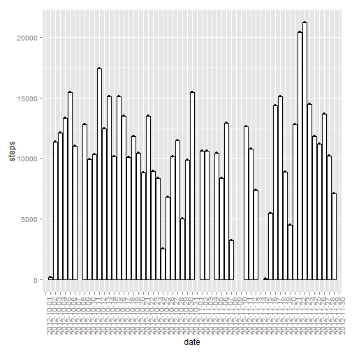
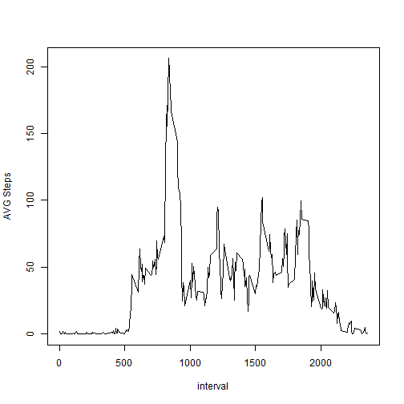
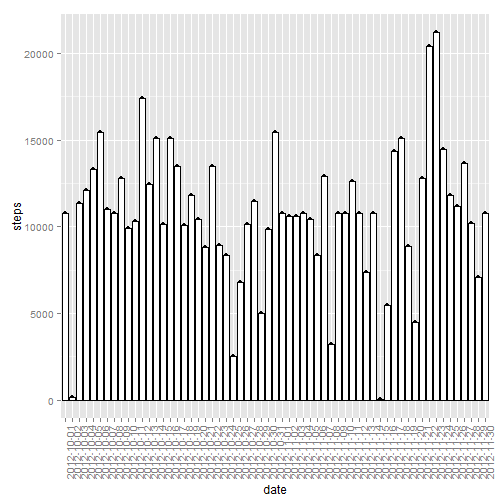

## Loading and preprocessing the data
1- Loading of the Data 

```r
library("reshape2")
library("ggplot2")
library("plyr")
library("lattice")

data <- read.csv("d:/activity.csv")
```

2- Preprocessing, melting and casting 

```r
dataMelt <- melt(data,id = c("date","interval"),measure.vars = c("steps"))
dataMelt$value <- as.double(dataMelt$value) 
stepSumEachDay = dcast(dataMelt,date~variable,sum)
```


## What is mean total number of steps taken per day?
1- a Histogram of the total number of steps taken each day

```r
qplot(date,steps,data = stepSumEachDay) + 
  geom_histogram(colour="black", fill="white",stat = "identity") + 
  theme(axis.text.x = element_text(angle = 90, hjust = 1))
```

```
## Warning: Removed 8 rows containing missing values (position_stack).
```

```
## Warning: Removed 8 rows containing missing values (geom_point).
```

 


2- The mean total number of steps taken per day

```r
stepMeanPerDay = dcast(dataMelt,date~variable,mean)
head(stepMeanPerDay)
```

```
##         date    steps
## 1 2012-10-01       NA
## 2 2012-10-02  0.43750
## 3 2012-10-03 39.41667
## 4 2012-10-04 42.06944
## 5 2012-10-05 46.15972
## 6 2012-10-06 53.54167
```
3- The median total number of steps taken per day

```r
stepMedianPerDay = dcast(dataMelt,date~variable,median)
head(stepMedianPerDay)
```

```
##         date steps
## 1 2012-10-01    NA
## 2 2012-10-02     0
## 3 2012-10-03     0
## 4 2012-10-04     0
## 5 2012-10-05     0
## 6 2012-10-06     0
```


## What is the average daily activity pattern?
1- a time series plot of the 5-minute interval and the average number of steps taken, averaged across all days 

```r
stepMeanPerInterval <-   dcast(dataMelt,interval~variable,function(y) mean(y,na.rm = T))
plot(as.numeric(as.character(stepMeanPerInterval$interval)),
     as.numeric(as.character(stepMeanPerInterval$steps))
     ,type = "l" ,xlab = "interval",ylab = "AVG Steps")
```

 


2- The 5-minute interval, on average across all the days in the dataset, contains the maximum number of steps

```r
stepMeanPerInterval[which.max(stepMeanPerInterval$steps),1]
```

```
## [1] 835
```


## Imputing missing values
1- total number of missing values in the dataset

```r
nrow(data[which(is.na(data$steps)),])
```

```
## [1] 2304
```
2- filling in all of the missing values in the dataset using the mean for that 5-minute interval

```r
NAData <- data[which(is.na(data$steps)),]
NAData <- NAData[,-1]
filledNA <- join(NAData,stepMeanPerInterval)
```

```
## Joining by: interval
```

```r
oldData <- data
data[which(is.na(data$steps)),1] <- filledNA$steps
```
3- Creating a new dataset that is equal to the original dataset but with the missing data filled in

```r
head(data)
```

```
##       steps       date interval
## 1 1.7169811 2012-10-01        0
## 2 0.3396226 2012-10-01        5
## 3 0.1320755 2012-10-01       10
## 4 0.1509434 2012-10-01       15
## 5 0.0754717 2012-10-01       20
## 6 2.0943396 2012-10-01       25
```
Checking if there is any NA data ...

```r
data[which(is.na(data$steps)),]
```

```
## [1] steps    date     interval
## <0 rows> (or 0-length row.names)
```

4- a histogram of the total number of steps taken each day 

```r
filledDataMelt <- melt(data,id = c("date","interval"),measure.vars = c("steps"))
filledDataMelt$value <- as.double(filledDataMelt$value) 
stepSumEachDayfilled = dcast(filledDataMelt,date~variable,sum)
qplot(date,steps,data = stepSumEachDayfilled) + 
  geom_histogram(colour="black", fill="white",stat = "identity") + 
  theme(axis.text.x = element_text(angle = 90, hjust = 1))
```

 

as we can see, the difference is : days that had missing values are now filled, that completed the histogram .. no more empty columns 

Calculating the mean total number of steps taken per day:

```r
stepMeanPerDayfilled <- dcast(filledDataMelt,date~variable,mean)
head(stepMeanPerDayfilled)
```

```
##         date    steps
## 1 2012-10-01 37.38260
## 2 2012-10-02  0.43750
## 3 2012-10-03 39.41667
## 4 2012-10-04 42.06944
## 5 2012-10-05 46.15972
## 6 2012-10-06 53.54167
```
using a filled data set eliminated the NA values from the results e.g. the first day

Calculating the median total number of steps taken per day:

```r
stepMedianPerDayfilled <- dcast(filledDataMelt,date~variable,median)
head(stepMedianPerDayfilled)
```

```
##         date    steps
## 1 2012-10-01 34.11321
## 2 2012-10-02  0.00000
## 3 2012-10-03  0.00000
## 4 2012-10-04  0.00000
## 5 2012-10-05  0.00000
## 6 2012-10-06  0.00000
```
using a filled data set made the days that had NA values get a median , while most of other days had zero as a median .. this is because we used the average of each interval 

## Are there differences in activity patterns between weekdays and weekends?
1- Creating a new factor variable in the dataset with two levels -- "weekday" and "weekend" indicating whether a given date is a weekday or weekend day.

```r
data$date <- as.Date(as.character(data$date))

dayFactor <- function (x) {
  if (weekdays(x) == "Sunday" | weekdays(x) == "Saturday") "weekend" else "weekday"
}
weekIdentifier <- sapply(data$date,dayFactor)
weekIdentifier <- factor (weekIdentifier,c("weekday","weekend"))
data$weekIdentifier <- weekIdentifier
head(data$weekIdentifier)
```

```
## [1] weekday weekday weekday weekday weekday weekday
## Levels: weekday weekend
```
2- Making a panel plot containing a time series plot of the 5-minute interval and the average number of steps taken, averaged across all weekday days or weekend days :

```r
filledDataMelt <- melt(data,id = c("date","weekIdentifier","interval"),measure.vars = c("steps"))
weekSplit <- split(filledDataMelt,filledDataMelt$weekIdentifier)
weekdays <- weekSplit[[1]]
weekDaysStepMeanPerInterval <- dcast(weekdays,interval~variable,mean)
weekends <- weekSplit[[2]]
weekEndsStepMeanPerInterval <- dcast(weekends,interval~variable,mean)
weekDaysStepMeanPerInterval$weekIdentifier <- "weekday"
weekEndsStepMeanPerInterval$weekIdentifier <- "weekend"
fullset <- rbind(weekDaysStepMeanPerInterval,weekEndsStepMeanPerInterval)

xyplot(steps ~ interval | weekIdentifier, data = fullset, layout = c(1, 2),type = "l")
```

 

By looking at the blot, we can spot that the overall steps number is bigger in weekend days
